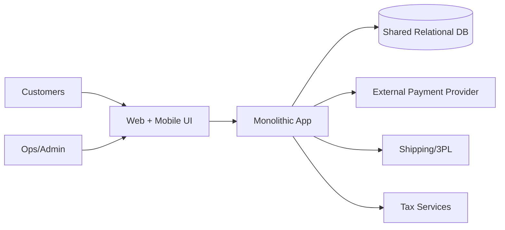
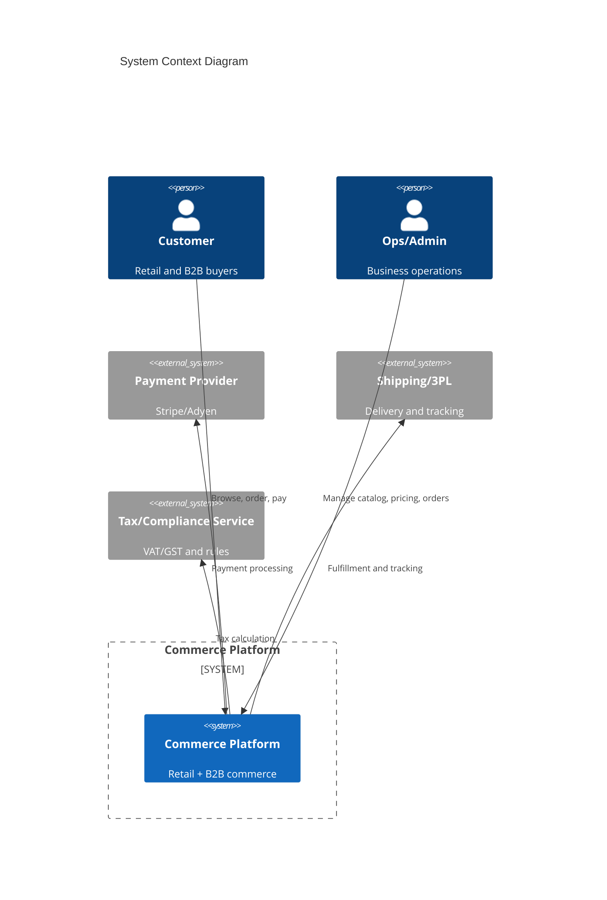
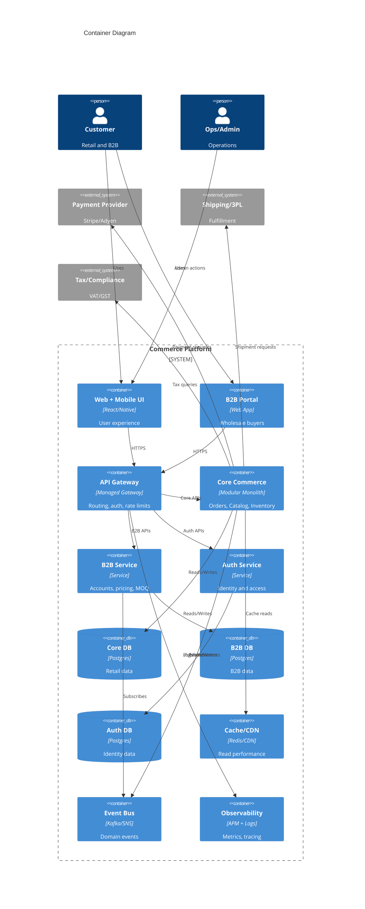

# Enterprise Architecture Plan

## Executive Summary
The current platform is a single-region monolith with a shared database and tightly coupled modules. This blocks international expansion, slows releases, and makes B2B features hard to deliver. The roadmap already shows a phased path: first break the monolith into clear internal modules, then add B2B and localization, and finally extract key services and improve compliance.

The target architecture focuses on controlled evolution, not a full rewrite. We start with a modular monolith to reduce risk and make teams faster, then extract only high-impact domains like B2B and Auth. This allows multi-region growth, stronger uptime, and regulatory compliance within the $2M budget and limited hiring.

## Current State Assessment
### System Landscape

**Description:** A single monolithic application serves all functions (Orders, Catalog, Payments, Users) and writes to one shared database. Observability is limited, and scaling is mostly vertical. Payment logic is embedded inside the monolith.

### Capability Analysis
| Capability | Current State | Gap | Priority |
|------------|--------------|-----|----------|
| Multi-region | None | Critical | High |
| B2B Support | None | Required | High |
| Scalability | Limited | Needed | Medium |
| Observability | Basic logs | Insufficient | Medium |
| CI/CD | Manual steps | Slow releases | Medium |
| Compliance (GDPR/Residency) | Not supported | Required | High |

### Technical Debt Inventory
- **Architecture:** Tight coupling between Orders, Catalog, Users, and Payments causes regression risk and long release cycles.
- **Data:** Single shared database with cross-domain tables blocks domain separation and regional data rules.
- **Operations:** Manual scaling and limited dashboards make outages harder to detect and fix.
- **Security:** Legacy auth and embedded payment logic increase audit risk.

## Target Architecture
### Vision
Over the next 3–5 years, evolve into a modular, multi-region platform that supports both retail and B2B. Core domains remain stable, while B2B and Auth become independent services with their own databases. API gateway, caching, and observability are standardized across services. Compliance (GDPR and data residency) is built into data flows and deployment regions.

### Architecture Principles
1. **Domain-first design:** Clear boundaries between Orders, Catalog, Inventory, B2B, and Auth to reduce coupling and ownership confusion.
2. **API-first integration:** Stable, versioned APIs for internal and external consumers to enable safe service extraction.
3. **Data ownership:** Each major domain owns its data store to reduce cross-service coupling and enable residency controls.
4. **Security by default:** Auth, payments, and compliance controls are treated as core platform services.
5. **Automated operations:** CI/CD, monitoring, and incident response are automated for faster recovery.

### System Context Diagram

### Container Diagram

### Key Architecture Decisions
| Decision | Options Considered | Choice | Rationale |
|----------|-------------------|--------|-----------|
| Monolith strategy | Big-bang rewrite vs Modular Monolith | Modular Monolith | Lower risk, faster stabilization, supports phased extraction |
| B2B separation | Keep in monolith vs Extract service | Extract after Phase 2 | B2B needs different scaling and pricing rules |
| API access | Direct services vs API Gateway | API Gateway | Centralized auth, rate limits, versioning |
| Data model | Shared DB vs Domain DBs | Domain DBs | Enables data residency and lower coupling |
| Payments | Build gateway vs Buy provider | Buy provider + orchestration | Faster compliance, lower maintenance |
| Regional setup | Active-active vs Active-passive | Active-passive initially | Lower cost and simpler ops, can evolve later |

## Governance
### Architecture Review Process
- Monthly architecture review with leads from Core, B2B, and Platform teams.
- All major changes require an ADR (Architecture Decision Record).
- Security and compliance checks are included in design reviews.

### Standards and Guidelines
- Versioned APIs with backward compatibility windows.
- Service-level ownership and runbooks.
- Data residency rules by market.
- Secure defaults: encryption in transit and at rest, least privilege access.

### Exception Handling
- Exceptions require written risk assessment and review by the Tech Lead.
- Exceptions expire after 90 days and must be re-approved or removed.
